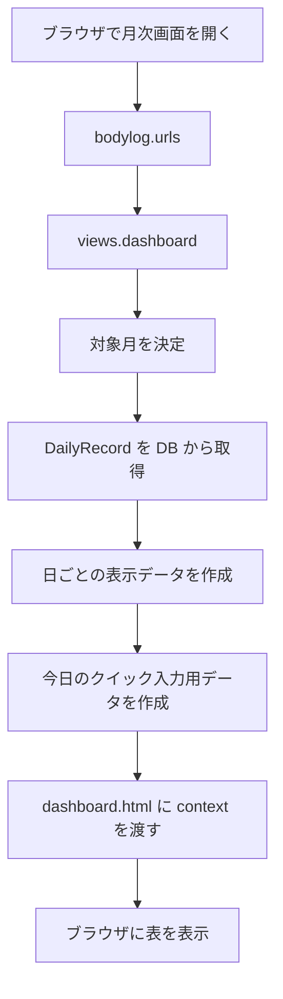
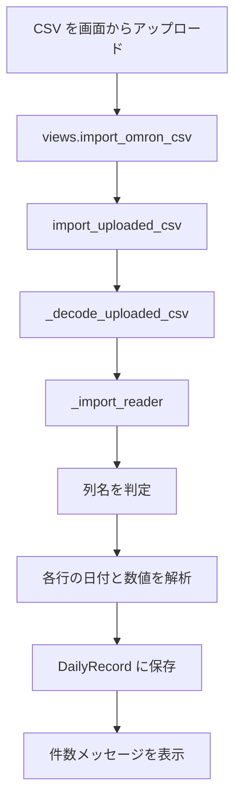
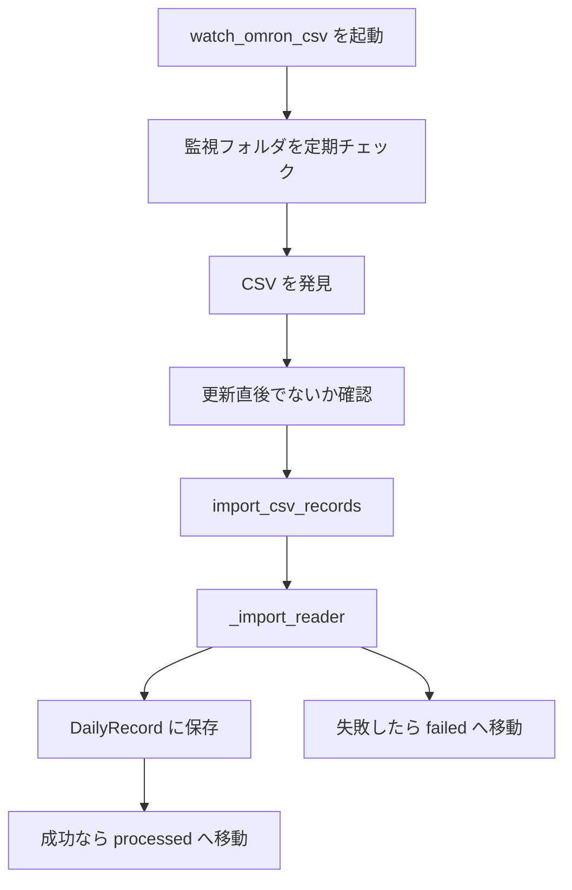

# Daily Body Log Project Guide

## プロジェクト概要

このプロジェクトは、毎日の食事、体重、内臓脂肪、運動時間、備考を記録するためのアプリです。

現在は Django 版が中心で、ブラウザから入力して使う構成になっています。

主な用途は次のとおりです。

- 日ごとの食事記録を入力する
- 体重と内臓脂肪を記録する
- 2食 / 3食の置き換えパターンを使って入力を簡略化する
- OMRON connect などから出力した CSV を取り込む
- 月単位で一覧表示して確認する

## ディレクトリ構成

### Django の入口と設定

- `manage.py`
  Django コマンドの入口です。`runserver`、`migrate`、`watch_omron_csv` などをここから実行します。

- `daily_body_log/settings.py`
  Django 全体の設定です。DB、テンプレート、タイムゾーン、アプリ登録などを管理します。

- `daily_body_log/urls.py`
  URL の親ルーターです。`bodylog` アプリへルーティングします。

- `daily_body_log/asgi.py`
  ASGI サーバー用の設定です。

- `daily_body_log/wsgi.py`
  WSGI サーバー用の設定です。

### アプリ本体

- `bodylog/models.py`
  データベースに保存する 1 日分の記録の定義です。

- `bodylog/views.py`
  画面表示や保存処理を担当する中心ファイルです。

- `bodylog/urls.py`
  `views.py` のどの関数をどの URL で呼ぶかを定義します。

- `bodylog/importers.py`
  CSV の列判定、日付解析、体重・内臓脂肪の取り込みを担当します。

- `bodylog/admin.py`
  Django 管理画面で `DailyRecord` を見やすく扱うための設定です。

- `bodylog/migrations/`
  データベースの構造変更履歴です。

### テンプレート

- `templates/bodylog/dashboard.html`
  月次ダッシュボードの HTML、CSS、JavaScript をまとめて持っています。

### 管理コマンド

- `bodylog/management/commands/import_csv_records.py`
  CSV を手動で取り込むコマンドです。

- `bodylog/management/commands/watch_omron_csv.py`
  監視フォルダに置かれた CSV を自動取り込みするコマンドです。

### データ

- `db.sqlite3`
  Django 版が使う SQLite データベースです。

- `data/omron_inbox`
  OMRON CSV の監視フォルダです。

- `data/omron_processed`
  取り込み成功後の退避先です。

- `data/omron_failed`
  取り込み失敗後の退避先です。

## データモデル

### `DailyRecord`

`bodylog/models.py` にある Django モデルです。

1 日分の記録を表し、次の情報を持ちます。

- `log_date`
  記録日。1 日に 1 レコードだけ持てます。

- `breakfast`
  朝食の記録です。

- `lunch`
  昼食の記録です。

- `dinner`
  夕食の記録です。

- `weight_kg`
  体重です。

- `visceral_fat_level`
  内臓脂肪値です。

- `exercise`
  運動時間です。

- `execution`
  備考です。

- `replacement_achieved`
  2食 / 3食の条件を満たしているかの状態です。

- `updated_at`
  最終更新時刻です。

## `bodylog/views.py` の関数説明

### `_build_exercise_options()`

運動時間のプルダウン候補を作る関数です。

30 分から 5 時間までを 30 分刻みで生成します。画面上の `exercise_options` はこの関数の結果を使っています。

### `_parse_optional_decimal(raw_value, field_label)`

体重や内臓脂肪の入力値を安全に数値へ変換する関数です。

- 空欄なら `None`
- 数字でなければエラー
- 0 以下でもエラー
- 最終的に小数第 1 位までの `Decimal` にそろえる

という役割を持ちます。

### `_split_multi_value(raw_value)`

食事文字列を内部用の配列に変換する関数です。

もともとは複数選択前提のための関数でしたが、現在は単一選択運用のため、先頭の 1 項目だけを返します。

### `_join_multi_value(values)`

画面側から渡された値リストを、保存用の 1 つの文字列に変換する関数です。

現在は有効な最初の 1 件だけを返します。

### `_replacement_count(breakfast, lunch, dinner)`

朝食・昼食・夕食の組み合わせから、`2食` または `3食` を判定する関数です。

条件は次のとおりです。

- `3食`
  朝食 = 活力＋VM1122
  昼食 = D24＋ジュニアバランス
  夕食 = NB

- `2食`
  朝食 = 活力＋VM1122
  昼食 = D24＋推奨食事
  夕食 = NB

一致しなければ空文字を返します。

### `_is_replacement_complete(breakfast, lunch, dinner)`

食事内容が 2食 または 3食 の達成条件を満たしているかを真偽値で返します。

表の `達成` 列の `◎ / -` の切り替えに使います。

### `dashboard(request, year=None, month=None)`

月次ダッシュボード画面を表示する関数です。

この関数がやっていることはかなり多いです。

1. 表示対象の年月を決める
2. DB からその月の記録を取得する
3. 月の日数ぶんループして、各日の表示用データを作る
4. 体重と内臓脂肪の前日値 placeholder を用意する
5. 今日のクイック入力欄のデータを用意する
6. 前月・翌月リンク用の年月を計算する
7. テンプレートへ全部まとめて渡す

### `save_record(request, date_value)`

画面から送られてくる 1 日分の入力内容を保存する API です。

この関数の役割は次のとおりです。

1. URL に含まれる日付を読み取る
2. 朝食・昼食・夕食・体重・内臓脂肪・運動・備考を取り出す
3. 数値を検証する
4. 2食 / 3食達成判定を行う
5. 全項目が空ならその日のレコードを削除する
6. 何か入力があれば DB に保存する
7. 保存結果を JSON で返す

### `import_omron_csv(request)`

画面からアップロードされた CSV を取り込む関数です。

- CSV ファイルが選ばれていない場合はエラー
- CSV 形式が合わない場合もエラー
- 正常時は取込件数をメッセージ表示

という流れです。

## `bodylog/importers.py` の関数説明

### `_normalize_header(value)`

CSV の列名を比較しやすくするために正規化します。

- 小文字化
- `_` を空白へ変換
- 余計な空白の削除

を行います。

### `_find_column(fieldnames, candidates)`

CSV の列一覧から、候補名に一致する列を探します。

たとえば `date`、`weight`、`visceral fat` など、いろいろな列名パターンを吸収するための関数です。

### `_parse_date(raw_value)`

CSV に入っている日付文字列を Python の日付型へ変換します。

`YYYY-MM-DD` や `YYYY/MM/DD` だけでなく、時刻付きの形式にも対応しています。

### `_parse_decimal(raw_value)`

CSV 内の数値文字列を `Decimal` に変換します。

- 空欄は `None`
- カンマ入り数値も対応
- 不正文字列はエラー
- 0 以下は `None`

という処理です。

### `_open_csv_text(path)`

CSV ファイルを開く際に、文字コードを考慮する関数です。

まず `utf-8-sig` を試し、失敗したら `cp932` を使います。

### `_decode_uploaded_csv(uploaded_file)`

ブラウザからアップロードされた CSV のバイナリデータを文字列に変換します。

複数の文字コード候補を順に試します。

### `_import_reader(reader)`

CSV 取り込みの本体です。

1. ヘッダーを読む
2. 日付列・体重列・内臓脂肪列を特定する
3. 各行を読み取る
4. 日付と数値を変換する
5. `DailyRecord` に保存する

という流れで動きます。

### `import_csv_records(csv_path)`

ファイルパスを指定して CSV を取り込むための入口関数です。

### `import_uploaded_csv(uploaded_file)`

ブラウザからアップロードされた CSV を取り込むための入口関数です。

### `move_processed_file(source_path, target_dir)`

処理済み CSV を、成功・失敗フォルダへ移動する関数です。

同名ファイルが衝突しないよう、タイムスタンプを付けて移動します。

## 管理コマンドの説明

### `bodylog/management/commands/import_csv_records.py`

#### `add_arguments(parser)`

コマンドライン引数 `--path` を受け取れるようにします。

#### `handle(*args, **options)`

指定された CSV を取り込んで、件数を表示します。

### `bodylog/management/commands/watch_omron_csv.py`

#### `add_arguments(parser)`

次の引数を受け取れるようにします。

- 監視フォルダ
- 成功時フォルダ
- 失敗時フォルダ
- 監視間隔
- 安定待機秒数

#### `handle(*args, **options)`

監視ループの入口です。

フォルダを用意し、無限ループで CSV を監視し続けます。

#### `_process_pending_files(...)`

監視フォルダ内の CSV を 1 件ずつ処理します。

- 更新直後すぎるファイルはスキップ
- 成功時は processed へ移動
- 失敗時は failed へ移動

という流れです。

## テンプレート内 JavaScript の主な関数

### `showGlobalStatus(message, className)`

保存完了やエラーなどを画面上部に短時間表示します。

### `appendChatMessage(role, message)`

チャットボット欄にメッセージを追加します。

### `buildChatReply(message)`

簡易チャットボットの返答を作ります。

### `getNavMatrix()`

表の入力欄を行列として扱うための補助関数です。

### `adjustNumericInput(field, direction)`

体重や内臓脂肪の値を `0.1` ずつ上下させる関数です。

### `focusRelative(currentField, rowOffset, colOffset)`

矢印キー操作で上下左右のセルに移動させます。

### `syncEntryScope(sourceScope, targetScope)`

上のクイック入力と下の今日の行の値を同期します。

### `updateAchievementMark(scope, achieved)`

達成欄の `◎ / -` の表示を切り替えます。

### `saveEntryScope(scope)`

指定された入力まとまりをサーバーに保存する関数です。

この画面の保存処理の中心です。

### `closeAllMenus(exceptMenu)`

食事の選択メニューを閉じます。

### `updateMultiSelect(wrapper)`

食事選択の表示テキストと内部値を更新します。

### `setMultiSelectValues(wrapper, values)`

2食 / 3食ボタンなどから食事選択値を一括設定します。

## 処理フロー図

### 1. 通常の画面表示



### 2. 行の保存処理

```mermaid
flowchart TD
    A[ユーザーが入力を変更] --> B[dashboard.html の JavaScript]
    B --> C[saveEntryScope]
    C --> D[/api/records/yyyy-mm-dd/ に POST]
    D --> E[views.save_record]
    E --> F[入力値を解析]
    F --> G[達成条件を自動判定]
    G --> H{すべて空か}
    H -- はい --> I[その日のレコードを削除]
    H -- いいえ --> J[DailyRecord を保存]
    I --> K[JSON を返す]
    J --> K
    K --> L[画面側で表示更新]
```

### 3. OMRON CSV 手動取込



### 4. OMRON CSV 自動取込



## 理解のためのおすすめの読み順

次の順番で読むと理解しやすいです。

1. `bodylog/models.py`
2. `bodylog/urls.py`
3. `bodylog/views.py`
4. `templates/bodylog/dashboard.html`
5. `bodylog/importers.py`
6. `bodylog/management/commands/watch_omron_csv.py`

## 補足

このプロジェクトは今、Django 版が主役です。

そのため、まず理解すべき中心は以下の 4 つです。

- `models.py`
- `views.py`
- `urls.py`
- `dashboard.html`

ここを理解すると、「どのデータを」「どの URL で」「どんな画面に表示し」「どう保存するのか」が見えてきます。
